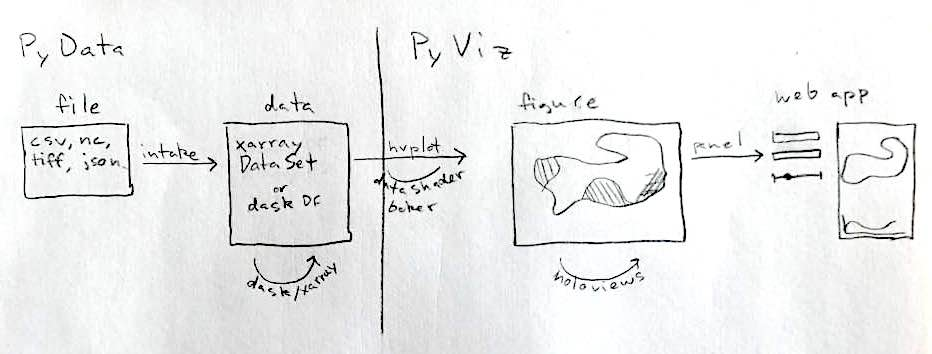
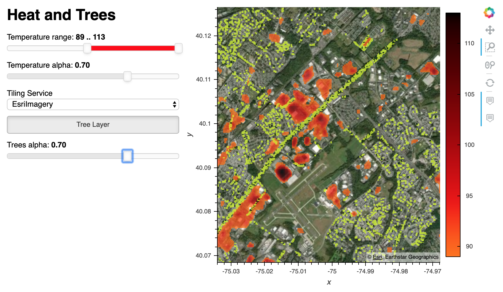

## Visualizing and Analyzing Earth Science Data Using PyViz and PyData

Earth Science presents interesting issues of large, multi-dimensional datasets stored in
a variety of idiosyncratic file formats. In this talk, we'll work through some specific
workflows and explore how various tools - such as intake, dask, xarray, and datashader -
can be used to effectively analyze and visualize these data. Working from within the
notebook, we'll iteratively build a product that is interactive, scalable and
deployable.



### Case Study: Heat and Street Trees

We'll be exploring the urban heat island effect by looking at the impact on surface temperature of roof color. We'll be replicating the process described here: http://urbanspatialanalysis.com/urban-heat-islands-street-trees-in-philadelphia/ but using Python tools rather than ESRI.



We'll also be adding interactivity and deploying the resulting application.

### Run on binder

<a href=https://mybinder.org/v2/gh/jsignell/pydata_ann_arbor_2019/master ></a>

### Run locally

```bash
conda env create --file environment.yml
conda activate trees
jupyter notebook
```

### Relevant materials

Recording: https://youtu.be/-XMXNmGRk5c

Static version: https://jsignell.github.io/heat_and_trees

### About me

I am a software developer at Anaconda Inc. currently working on developing best
practices for Python-using earth scientists. I work on visualization tools within the
PyViz ecosystem and data ingestion and analysis tools in the broader PyData world. I
live in Philadelphia and previously did hydrology research at Princeton - studying
lightning and rain patterns, water movement through the landscape, and streamflow.
